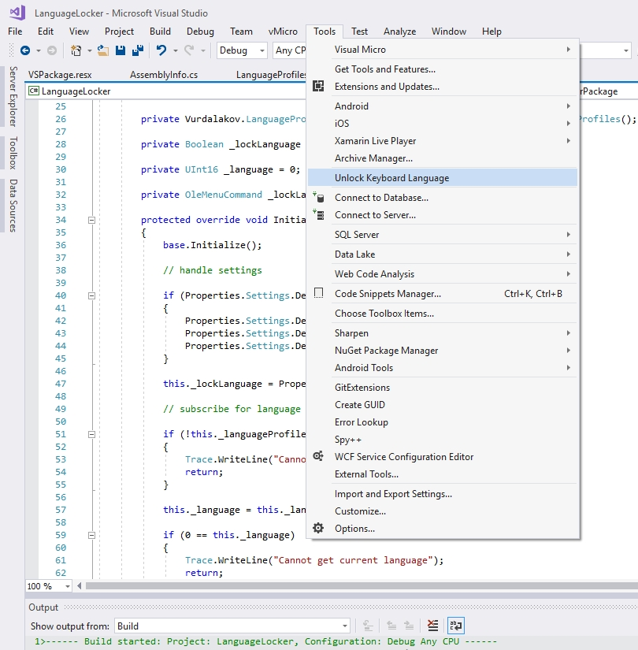

# Language Locker

**Language Locker** is a Visual Studio 2017/2019 extension that prevents switching of keyboard layout (e.g. English to Russian) while working in Visual Studio.

It does not affect language switching in other applications.

Select **Tools** and then **Unlock Keyboard Language** to allow language switching in Visual Studio.

**Install extension** directly from Visual Studio using the" Extensions and Updates" dialog, or **download VSIX package** from [Visual Studio Marketplace](https://marketplace.visualstudio.com/items?itemName=vurdalak1.languagelocker).

---

**Language Locker** — это расширение Visual Studio 2017/2019 для блокировки случайного переключения раскладки клавиатуры (например, с английской на русскую). Не блокирует переключение раскладки в других приложениях. Если необходимо отключить блокировку, выберите пункт **Unlock Keyboard Language** в меню **Сервис** (**Tools**).

Установить расширение можно с помощью диалогового окна **Сервис/Расширения и обновления** (**Tools/Extensions and Updates**) или из [галереи Visual Studio](https://marketplace.visualstudio.com/items?itemName=vurdalak1.languagelocker).

---

---

`Language Locker` extension is distributed under the [MIT license](http://opensource.org/licenses/MIT).
