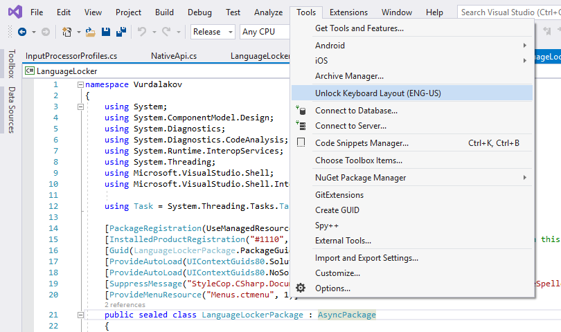

# Language Locker

**Language Locker** is a Visual Studio 2017/2019 extension that prevents switching of keyboard layout (e.g. English to Russian) while working in Visual Studio.

It does not affect language switching in other applications.

Select **Tools** and then **Unlock Keyboard Layout** to allow language switching in Visual Studio.

**Install extension** directly from Visual Studio using the "Manage Extensions" dialog ("Extensions and Updates" dialog in VS2017), or **download VSIX package** from [Visual Studio Marketplace](https://marketplace.visualstudio.com/items?itemName=vurdalak1.languagelocker).

---

**Language Locker** — это расширение Visual Studio 2017/2019 для блокировки случайного переключения раскладки клавиатуры (например, с английской на русскую).

Не блокирует переключение раскладки в других приложениях.

Если необходимо отключить блокировку, выберите пункт **Unlock Keyboard Layout** в меню **Сервис** (**Tools**).

Установить расширение можно с помощью диалогового окна **Сервис/Расширения и обновления** (**Tools/Extensions and Updates**) или из [галереи Visual Studio](https://marketplace.visualstudio.com/items?itemName=vurdalak1.languagelocker).

## License

`Language Locker` extension is distributed under the terms of the [MIT license](https://opensource.org/licenses/MIT).

## Acknowledgments

* [Palaso Library](https://github.com/sillsdev/libpalaso)
